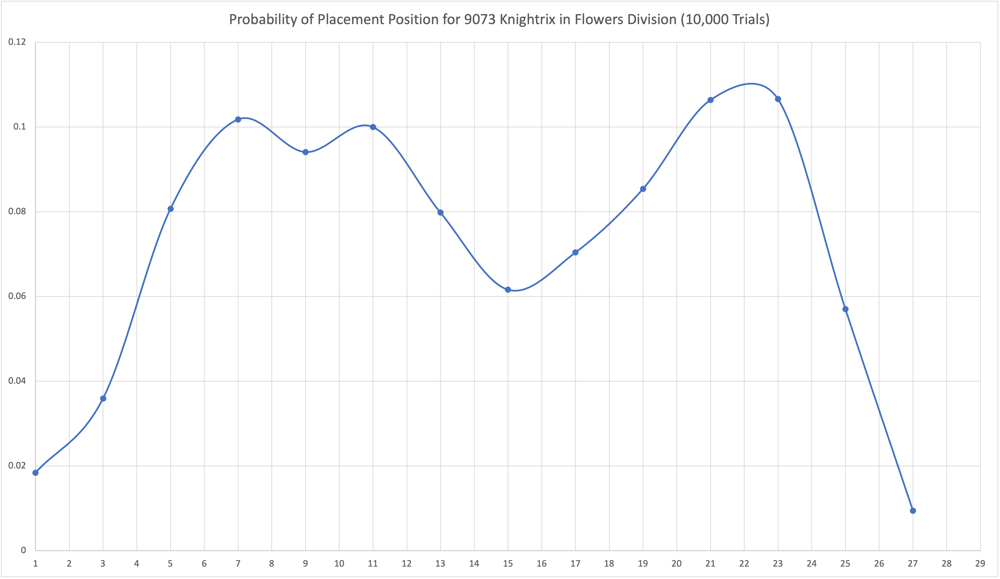
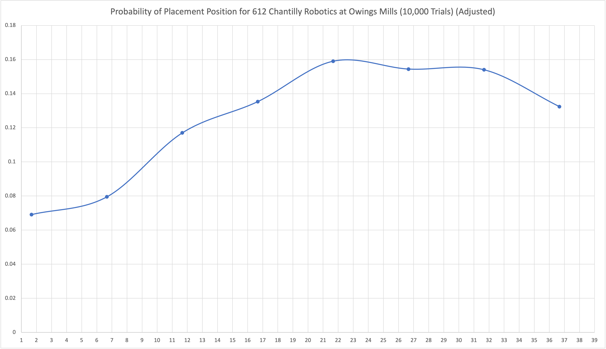

# RoboticsStats
Statistics for predicting the placements of two robotics teams (FTC 9073, FRC 612) during the 2019-2020 season.

Predictions for two robotics teams were done by using the OPR for each team competing in the competition and running many thousand trials to compile the probabilities of each placement for the team compared to all others competing.

## Examples

### 9073 Knightrix, Virginia Championship - Flowers Divison, 2020

### 612 Chantilly Robotics, Chesapeake Owings Mills Event, (Cancelled)

